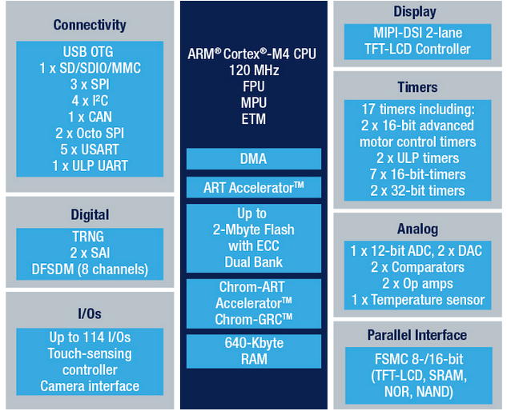

# BSP_BOARD_STM32L4R9ZI_MKSBOX1V1

## Product introduce

 [SensorTile.box website](https://www.st.com/en/evaluation-tools/steval-mksbox1v1.html)

## CPU STM32L4R9ZI

[STM32L4R9ZI](https://www.st.com/en/microcontrollers-microprocessors/stm32l4r9zi.html)

### Introduce

- ROM: 2MKB (0x8000000 + 0x200000)
- RAM: 640KB (0x20000000 + 0xA0000)
- MAX Frequence: 120MHZ
- CORE: ARM CORTEX-M4 + FPU
- 150 DMIPS/1.25 DMIPS/MHz (Dhrystone 2.1),

### datasheet

[STM32L4R9ZI DATASHEET](https://www.st.com/resource/en/datasheet/stm32l4r9zi.pdf)

### Reference Manuals 

[STM32L4 Reference Manuals](https://www.st.com/resource/en/reference_manual/rm0432-stm32l4-series-advanced-armbased-32bit-mcus-stmicroelectronics.pdf)

##  Board info

### Clock Sources

- 16 MHz crystal oscillator
- 32 kHz crystal oscillator for RTC (LSE)

### LED

- Blue LED  = PB15
- Green LED = PF2

### Push buttons

- BUTTON = USER (PG1)
- BUTTON = BOOT (used to let the SensorTile.box enter DFU mode. 
- BUTTON = PWR (used to Power on/off the board when battery is connected)

### SPI BUS

|      | MOSI | MISO | CLK  |      |
| ---- | ---- | ---- | ---- | ---- |
| SPI1 | PE15 | PE14 | PE13 |      |
| SPI2 | PC3  | PD3  | PD1  |      |
| SPI3 | PB5  | PB4  | PB3  |      |

### IIC BUS

|      | SDA  | SCK  | sensor          |
| ---- | ---- | ---- | --------------- |
| I2C1 | PB7  | PB6  | HTS221、LPS22HH |
| I2C3 | PG8  | PG7  | STTS751         |
|      |      |      |                 |

### BLE

Bluetooth Smart connectivity v4.2 (SPBTLE-1S)

interface： SPI2

SPI2_CS: PD0

|              | BLE_PIN        | STM32_PIN |
| ------------ | -------------- | --------- |
| CPU_LED      | DIO12          | PB15      |
| UART2_BLE_RX | DIO11          | PD6       |
| UART2_BLE_TX | DIO8           | PD5       |
| BLE_INT      | ANATEST0/DIO14 | PD4       |
| NRST_BLE     | RESET          | PA8       |
| SPI2_CS      | DIO1           | PD0       |

### SENSOR 

|            | TYPE          | BUS  | CS   |                                |
| ---------- | ------------- | ---- | ---- | ------------------------------ |
| LIS2DW12   | ACCELEROMETER | SPI1 | PE11 | ACC_INT1(PC5) ACC_INT2(PD14)   |
| IIS3DHHCTR | ACCELEROMETER | SPI3 | PE10 | ACC2_INT1(PC13) ACC2_INT2(PE6) |
| LIS2MDLTR  | MAGNETOMETER  | SPI3 | PA15 | INT_MAG(PD12)                  |
| LSM6DSO    | 3D ACC+GYR    | SPI1 | PE12 | INT1_DSR(PA2) INT2_DSR(PE3)    |
| HTS221     | HUM + TEMP    | I2C1 |      | INT_HTS(PD13)                  |
| STTS751    | TEMPERATURE   | I2C3 |      | EVENT_STT(PG6) INT_STT(PE1)    |
| LPS22HH    | PRESSURE      | I2C1 |      | INT_PRESS(PD15)                |
|            |               |      |      |                                |

## FIRMWARE

恢复出厂值

官方提供firmware [BLEFOTA_BL_1.0.0.bin](04_firmware\BLEFOTA_BL_1.0.0.bin) 这个没有APP还需要用apk下载 [使用说明stsw-mksbox1-bl](04_firmware\stsw-mksbox1-bl.pdf) 

dump出来的firmware [FACTORY_RESET.bin](04_firmware\FACTORY_RESET.bin) 这个集成了APP

## References

[1] [电子森林  SensorTile.box中用到的传感器](https://www.eetree.cn/doc/detail/2277)

[2] [FUNPACK 第7期](https://www.eetree.cn/project/detail/312)

[3] [SensorTile.box 传感器大揭秘](https://mp.weixin.qq.com/s/FF9vKqZDSE0_AXqlLSRU-g)

